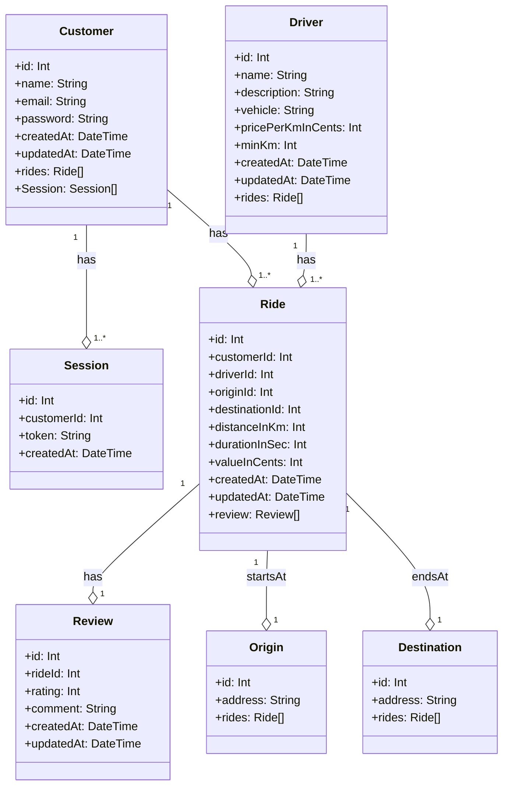

# About

This is a Uber like app, using google maps api to get the distance between two locations asked by the user,
then it returns a list of drivers and the price of the ride.

## Diagram Classes

## Endpoints

POST "/users"
Body: { name, email, password }
Response: {
          id,
          email,
          username,
}

POST "/auth/sign-in"
Body: { email, password }
Response: {
    user: exclude(user, 'password'),
    token,
  };

POST "/ride/estimate"
Body: {origin, destination }
Reponse: {
      origin: {
        latitude: originLocation.lat,
        longitude: originLocation.lng,
      },
      destination: {
        latitude: destinationLocation.lat,
        longitude: destinationLocation.lng,
      },
      distance: DistanceStrToNumber(distanceInfo.distance.text),
      duration: distanceInfo.duration.text,
      options: drivers
        .filter((driver) => driver.minKm <= distanceInfo.distance.value / 1000) // Filter drivers based on minKm
        .map((driver) => ({
          id: driver.id,
          name: driver.name,
          description: driver.description,
          vehicle: driver.vehicle,
          review: driver.rides.flatMap((ride) =>
            Array.isArray(ride.review)
              ? ride.review.map((review) => ({
                  rating: review.rating,
                  comment: review.comment,
                }))
              : [],
          ),
          // Distance is in meters, price in km * cents, value in km * currency
          value: ((distanceInfo.distance.value * driver.pricePerKmInCents) / 100000).toFixed(2),
        }))
        .sort((a, b) => parseFloat(a.value) - parseFloat(b.value)), // Sort by value
      routeResponse: distanceMatrix.data,
    }

PATCH "/ride/confirm"
Body: {origin, destination, distance, duration, driver, value}
Reponse: { success: true }

GET "/ride/?driver_id"
Query: {driver_id}
Reponse: {
    rides: {
        id: number;
        customerId: number;
        driverId: number;
        originId: number;
        destinationId: number;
        distanceInKm: number;
        durationInSec: number;
        valueInCents: number;
        createdAt: Date;
        updatedAt: Date;
    } ## Rides can be filtered by driverId
}