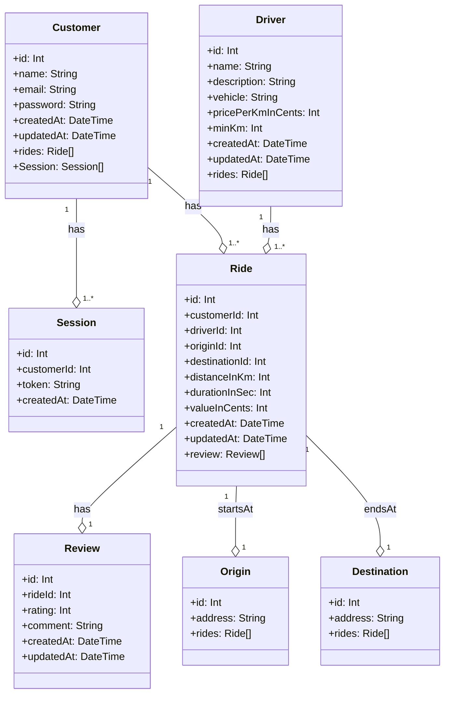

## Diagram Classes

```mermaid
classDiagram
    class Customer {
        +id: Int
        +name: String
        +email: String
        +password: String
        +createdAt: DateTime
        +updatedAt: DateTime
        +rides: Ride[]
        +Session: Session[]
    }

    class Session {
        +id: Int
        +customerId: Int
        +token: String
        +createdAt: DateTime
    }

    class Driver {
        +id: Int
        +name: String
        +description: String
        +vehicle: String
        +pricePerKmInCents: Int
        +minKm: Int
        +createdAt: DateTime
        +updatedAt: DateTime
        +rides: Ride[]
    }

    class Review {
        +id: Int
        +rideId: Int
        +rating: Int
        +comment: String
        +createdAt: DateTime
        +updatedAt: DateTime
    }

    class Origin {
        +id: Int
        +address: String
        +rides: Ride[]
    }

    class Destination {
        +id: Int
        +address: String
        +rides: Ride[]
    }

    class Ride {
        +id: Int
        +customerId: Int
        +driverId: Int
        +originId: Int
        +destinationId: Int
        +distanceInKm: Int
        +durationInSec: Int
        +valueInCents: Int
        +createdAt: DateTime
        +updatedAt: DateTime
        +review: Review[]
    }

    %% Relationships
    Customer "1" --o "1..*" Session : has
    Customer "1" --o "1..*" Ride : has
    Driver "1" --o "1..*" Ride : has
    Ride "1" --o "1" Review : has
    Ride "1" --o "1" Origin : startsAt
    Ride "1" --o "1" Destination : endsAt

```