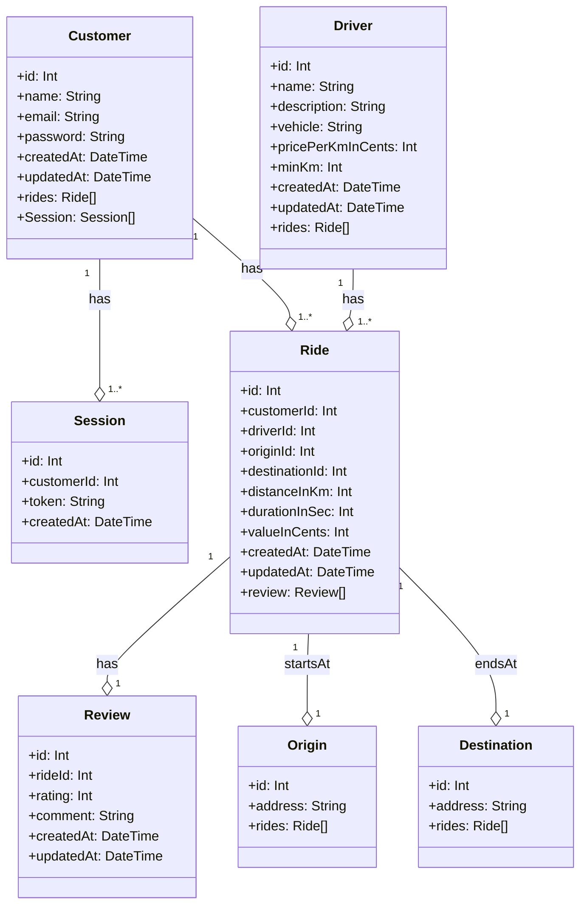

## Diagram Classes

## Endpoints

POST "/users"
Body: { name, email, password }
Response: {
          id,
          email,
          username,
}

POST "/auth/sign-in"
Body: { email, password }
Response: {
    token
  };

POST "/ride/estimate"
Body: {origin, destination }
Response: {
      origin: {
        latitude,
        longitude,
      },
      destination: {
        latitude,
        longitude,
      },
      distance,
      duration,
      options:{ ## multiple drivers
          id: driver.id,
          name: driver.name,
          description: driver.description,
          vehicle: driver.vehicle,
          review:{ ## multiple reviews
                  rating: review.rating,
                  comment: review.comment,
              },
          value:,
      }
      routeResponse,
    }

PATCH "/ride/confirm"
Body: {origin, destination, distance, duration, driver, value}
Response: { success: true }

GET "/ride/?driver_id"
Query: {driver_id}
Response: {
    rides: { ## multiple rides
        id: number;
        customerId: number;
        driverId: number;
        originId: number;
        destinationId: number;
        distanceInKm: number;
        durationInSec: number;
        valueInCents: number;
        createdAt: Date;
        updatedAt: Date;
    } ## Rides can be filtered by driverId
}